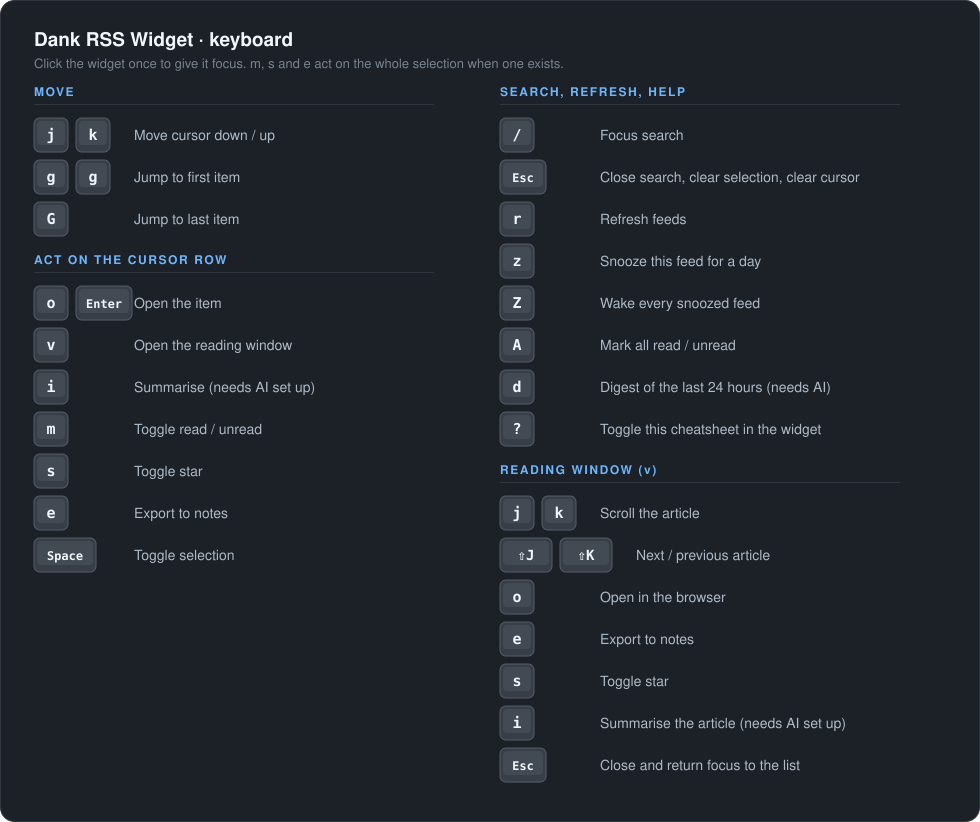

# Dank RSS Widget

A desktop widget for [DankMaterialShell](https://github.com/AvengeMedia/DankMaterialShell)
that puts your feeds on your desktop — fetched directly, or synced from
Miniflux or any Google Reader API server.


## Features

- **RSS 2.0 and Atom**, auto-detected, with thumbnails, compact/expanded views
  and sort by newest, oldest or feed
- **Sync** with [Miniflux](https://miniflux.app/) or any Google Reader API
  server (FreshRSS, TT-RSS, Inoreader, TheOldReader, BazQux) — bidirectional
  read and starred state
- **Keyboard-driven**, vim-style, with a `?` cheatsheet in the widget
- **Reading window** (`v`) that typesets one article at a readable measure,
  with summary-only mode and "Load full article" (`f`), podcast playback
  (`p`), and copy-to-clipboard (`c`)
- **AI, opt-in and local** via any OpenAI-compatible runtime (ollama, vLLM,
  llama.cpp, LM Studio) — per-article summaries (`i`) and a 24-hour digest
  (`d`); interest ranking is available but off by default
- **Notes export** (`e`) to a markdown folder, Obsidian or Neovim, with
  downloaded images, optional local full-text extraction — measured at 92% of
  Mozilla Readability — and a Miniflux server-side fast path
- **Open the note in your editor** — VS Code, Zed, Emacs, Neovim, Helix, Vim,
  or your own command
- **Accessible**: an accessible name on every icon-only control, plus
  colour-blindness palettes (deuteranopia, protanopia, tritanopia) alongside
  Nord, Gruvbox, Catppuccin, Dracula, Solarized and a Custom theme
- All / Unread / Saved filters with live counts, category/folder filtering on
  backends that support it, and search across title, description and source
- Feed management: add, edit, reorder, enable/disable, autodiscovery, OPML
  import/export, quick-add presets, per-feed refresh intervals, per-source
  snooze (`z` / `Shift+Z`), rule-based notifications, per-feed status and
  readable errors
- Auto-refresh from 5 minutes to 24 hours, mark-read-on-scroll, plus new-item
  toasts that stay silent on first run

## Keyboard

Click the widget once to give it focus, then drive it from the keyboard.



## Install

**From the DMS Plugin Manager** — search for "Dank RSS Widget".

**Manually:**

```bash
git clone https://github.com/BrendonJL/dms-rss-widget.git
ln -s /path/to/dms-rss-widget ~/.config/DankMaterialShell/plugins/dankRssWidget
```

Reload DMS (Ctrl+Shift+R) or restart your compositor.

### Requirements

- DankMaterialShell >= 1.2.0
- `curl`
- A Miniflux or Google Reader API server and credentials — only for sync modes
- An OpenAI-compatible runtime (e.g. ollama) — only for AI summaries, digest
  and ranking, all opt-in and off by default

## Configuration

Open the widget settings and pick a **Source**. In RSS mode, add feeds by name
and URL or use the quick-add presets; each feed can be enabled, disabled and
reordered, and the stored order is what "grouped by feed" sort follows. In
Miniflux or Google Reader mode, enter your server URL and credentials and hit
**Test Connection** — on Miniflux and FreshRSS the Google Reader credentials
are the API ones from the server's integration settings, not your web login.
The rest is refresh interval (default 30 minutes), max items (default 20),
appearance, and an optional Notes Export folder. Credentials are stored in
plaintext alongside every other setting.

## Known limitations

- **No local article archive.** A bookmark is stored by item ID and survives
  restarts, but Saved can only show items still present in the fetched set, so
  an item that scrolls out of its feed stays bookmarked but invisible until it
  is fetched again.
- **Deleting the state file clears bookmarks too** — read/seen state,
  bookmarks, cached AI summaries, snoozes and per-feed refresh timestamps all
  live in the same file.
- **Two widget instances share one read/bookmark history** (it is keyed by
  plugin ID), but *not* one set of settings — every setting is per-instance,
  with the global store as a default.
- **Full-text extraction is off by default** and makes one outbound request per
  exported article. It falls back to the feed summary on anything that looks
  like a section front rather than an article.
- At widths approaching the 100px floor, the filter chips crowd each other.
  Chip wrapping or eliding is not implemented; at default width and above it is
  not visible.
- Compact rows reserve slightly more vertical padding than their margins need.
- No plugin hot-reload — `dms restart` after an update.

## Documentation

Full docs are on the [wiki](https://github.com/BrendonJL/dms-rss-widget/wiki).
The page sources live in [`docs/wiki/`](docs/wiki/):

- [Architecture](docs/wiki/Architecture.md) — module layout, the backend
  interface, and the two rules that are easy to violate
- [Sources and Sync](docs/wiki/Sources-and-Sync.md) — RSS, Miniflux and Google
  Reader modes
- [Notes Export](docs/wiki/Notes-Export.md) — providers, editor presets,
  full-text extraction and images
- [Data and Persistence](docs/wiki/Data-and-Persistence.md) — where settings
  and state live, desktop widget instances, upgrading from 1.x
- [Development](docs/wiki/Development.md) — the three test tiers and the
  extraction oracle
- [CI](docs/wiki/CI.md) — what runs on a PR, and why qmllint is not one of them
- [Roadmap](docs/wiki/Roadmap.md) — what is shipped, planned, and open to
  contributors
- [Related Plugins](docs/wiki/Related-Plugins.md)

Release notes are in [`CHANGELOG.md`](CHANGELOG.md); design docs in
[`docs/plans/`](docs/plans/).

## License

MIT
