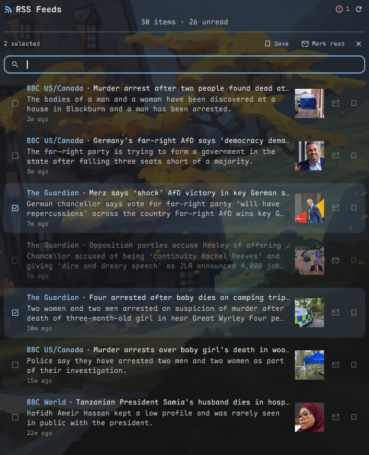

# Dank RSS Widget

A desktop widget for [DankMaterialShell](https://github.com/AvengeMedia/DankMaterialShell) that shows RSS and Atom feeds on your desktop, either fetched directly or synced from a [Miniflux](https://miniflux.app/) server.



## Features

**Reading**
- RSS 2.0 and Atom, auto-detected; thumbnails from `media:thumbnail`, `media:content` or enclosures
- Compact and expanded views, configurable font size, sort by newest, oldest or feed
- Click to open and mark read; a per-row checkbox toggles read state without opening
- Bookmarks and read state persist across restarts, keyed by stable item ID
- All / Unread / Saved filters with live counts, plus search across title, description and source

**Managing feeds**
- Add, edit, reorder and enable/disable feeds in settings, with URL validation
- OPML import and quick-add presets (news, tech, Reddit)
- Per-feed fetch status with item counts and readable error text
- Auto-refresh from 5 minutes to 24 hours, plus a manual refresh button
- New-item toast notifications, silent on first run so there is no backlog spam

**Miniflux mode**
- Use a self-hosted Miniflux server instead of fetching feeds directly
- Bidirectional read/unread and starred sync, batched into one API call per action

## Roadmap

Designs live in [`docs/plans/`](docs/plans/). Contributors welcome — the **Phase 6** items below are self-contained and are the best place to start.

**Done, awaiting release**

- Search focus and search-during-selection fixes
- **Phase 0** — backend provider interface. Every `sourceMode` branch in the widget is gone (17 → 0), leaving one dispatch point.
- **Phase 1** — Google Reader API backend and chained-request runner. Verified against a live server; no settings UI yet.
- **Phase 3a** / **Phase 4a** — `AiProvider.js` and `ExportProvider.js`. No UI yet.
- Three fixes for bugs shipped in 2.3.3: mark-as-read never reached Miniflux (`entry_ids` must be `int64`), every Miniflux API error was silently discarded (`curl` exits 0 on an HTTP 400), and the settings panel showed stale feed status.

**Planned**

| Phase | Work | Depends on |
|---|---|---|
| 1c | Settings UI for Google Reader | 1 |
| 2 | Keyboard navigation (`j`/`k`/`o`/`m`/`s`, `/` to search) | — |
| 3 | Local AI via any OpenAI-compatible runtime: per-article TL;DR, digest, interest ranking | 3a |
| 4 | Notes export: markdown directory, Obsidian, Neovim | 4a |
| 5 | Reader + annotation app — a standalone window for reading, highlighting and note-taking | 3, 4 |
| 6 | Independent smaller items, below | — |

**Phase 6 / good first issues**

Feed autodiscovery (paste a site URL, find its feed) · OPML **export** (import already exists) · categories/folders · per-feed refresh intervals · audio enclosures → MPRIS so podcasts play through the DMS media widget · rule-based notifications · mark-read-on-scroll · per-source snooze.

**Design principle:** anything with a vendor name gets an interface with presets, never a hardcoded integration. Feed backends speak the Google Reader API, AI runtimes speak the OpenAI-compatible chat API, and notes apps are "write a markdown file to a directory". Adding ollama must not make vLLM harder.

**Not planned:** Fever API (reaches only backends Google Reader already covers, and is read-only in Miniflux) and Evernote export (its local API was retired). Open to a contributor who wants either.

## Miniflux mode

Set **Source** to *Miniflux* in settings, enter your server URL and an API token (Miniflux → Settings → API Keys), and hit **Test Connection**.

Miniflux mode replaces the RSS-only settings sections (Feed Management, OPML Import, Quick Add) with a Connection section offering server URL and token fields, **Mark as read on open**, **Show starred entries** (fetch bookmarks instead of unread), Test Connection / Force Refresh, and a read-only list of your subscriptions.

Entries flow through the same row UI as RSS items. The mark-read control and the bookmark icon push read and **starred** state to the server — the bookmark icon doubles as the star, rather than adding a second control. Bulk actions batch into one API call each. Every fetch reconciles server state back into local state, so the server wins after each refresh while local clicks stay instant.

Switching modes never clears read or bookmark history in either direction: ids are prefixed per source (`m:`, `r:`, `g:`/`l:`/`h:`), so the two sets cannot collide.

**The API token is stored in plaintext** in the plugin's settings, like every other setting. Keep that in mind if your DMS settings are backed up or synced.

## Known limitations

- At widths approaching the 100px floor, the filter chips crowd each other. Solving it needs chip wrapping or eliding, which is not implemented; at default width and above it is not visible.
- Compact rows reserve slightly more vertical padding than their margins need.
- A bookmark is stored by item ID and survives restarts, but Saved can only show items still present in the fetched set. There is no local article archive, so an item that scrolls out of its feed stays bookmarked but invisible until it is fetched again.

## Installation

### From the DMS Plugin Manager

Search for "Dank RSS Widget" in the DMS plugin manager.

### Manual Installation

Clone or symlink this repo into your DMS plugins directory:

```bash
git clone https://github.com/BrendonJL/dms-rss-widget.git
ln -s /path/to/dms-rss-widget ~/.config/DankMaterialShell/plugins/dankRssWidget
```

Reload DMS (Ctrl+Shift+R) or restart your compositor.

## Configuration

Open the widget settings to:

1. **Add feeds** — Enter a name and RSS/Atom URL, or use the quick-add presets
2. **Enable/disable feeds** — A disabled feed stays configured and editable but is not fetched
3. **Reorder feeds** — Move-up/move-down buttons set the stored feed order, which is the order "grouped by feed" sort follows. Reordering closes an open edit form, since a swap would leave it pointing at the wrong feed.
4. **Set refresh interval** — How often feeds are fetched (default: 30 minutes)
5. **Max items** — Limit displayed items (default: 20)
6. **Appearance** — Background opacity, border toggle/color/thickness

Each configured feed shows a status line: item count when its last fetch succeeded, the error/timeout text when it failed, or "Not fetched yet" before the widget has run.

## Requirements

- DankMaterialShell >= 1.2.0
- `curl` (used for fetching feeds)
- A running Miniflux server and API token — only if you use Miniflux mode

## Data & persistence

Plugin data is split across two tiers:

- **Settings** (`~/.config/DankMaterialShell/settings.json`, shared with the rest of DMS) — your configured feeds, refresh interval, max items, sort mode, and appearance preferences. Written via `pluginService.setData` / read via `getData`.
- **State** (`~/.local/state/DankMaterialShell/plugins/dankRssWidget_state.json`, a dedicated per-plugin file) — read/seen item IDs, bookmarked item IDs (`bookmarkedIds`), and per-feed fetch status. Written via `pluginService.savePluginState` / read via `loadPluginState`. This file is not part of your shared DMS settings and is not synced or backed up along with them. The state tier is not permission-gated separately from the rest of the plugin.

To reset read/unread state (mark everything unread and clear notification history) without touching your configured feeds, delete the state file:

```bash
rm ~/.local/state/DankMaterialShell/plugins/dankRssWidget_state.json
```

(The directory comes from Quickshell's `Paths.state`, i.e. the XDG generic state location plus `/DankMaterialShell`.) **Note:** this also clears your bookmarks — they live in the same file as read/seen state, not a separate one.

### A note on desktop widget instances

DMS can run this plugin either as a global plugin or as a **desktop widget instance**
(an entry under `desktopWidgetInstances` in `settings.json`). Instances get their feeds
and preferences from their own per-instance `config` block, not from the shared
`pluginSettings` section — so two instances can show different feeds.

Instances are also handed a *reduced* plugin service by DMS
(`instanceScopedPluginService` in `DesktopPluginWrapper.qml`) that implements only
`loadPluginData`/`savePluginData` and has **no** `loadPluginState`/`savePluginState`.
The widget therefore resolves the real `PluginService` singleton for state access and
feature-detects before calling it, so read/seen/bookmark persistence works in both
modes and a missing state API can never block feed fetching. Reader state is keyed by
plugin ID, so multiple instances share one read/bookmark history.

## Architecture

Logic that can be pure is kept out of QML, in modules at the repo root. QML owns side effects — running processes, showing toasts, assigning properties — and nothing else.

| Module | Responsibility |
|---|---|
| `FeedParser.js` | RSS/Atom/OPML parsing, stable item IDs, image extraction, relative time |
| `ReaderState.js` | Read/seen/bookmark bookkeeping, bounding, new-item detection, search and filtering, fetch classification, feed enable/disable and ordering |
| `Backends.js` | The backend interface: `capabilities` plus request descriptors for the standard and Miniflux backends |
| `GoogleReader.js` | Google Reader API backend (FreshRSS, TT-RSS, Inoreader, TheOldReader, BazQux, Miniflux) |
| `ChainRunner.js` | Steps a chained request sequence, so the QML runner holds no counter arithmetic |
| `AiProvider.js` | Client for any OpenAI-compatible runtime (ollama, vLLM, llama.cpp, LM Studio) |
| `ExportProvider.js` | Builds note paths and markdown for the notes providers |

Each is imported the same way (`import "FeedParser.js" as FeedParser`) and `require()`d unchanged by the Node tests — there is no second copy of the logic to keep in sync.

Two rules that are easy to violate and hard to notice:

**No `.pragma library` line.** It is required for QML-only JS modules in some contexts, but it is not valid JavaScript and `require()` fails on it immediately. Adding one breaks the test suite without breaking the widget. CI greps for it.

**Modules never `require()` each other.** `require` does not exist under QML and `.import` is not valid JavaScript, so neither works in both runtimes. Modules that need a sibling take it as an argument instead — `createBackends({ FeedParser, ReaderState, GoogleReader })`.

Backends return **request descriptors** (`{ argv, parse, timeoutMs, meta }`) and perform no I/O, which is what makes a protocol testable without a server. Every backend takes the same arguments in the same order, because the caller invokes them positionally without knowing which one it holds; `tests/backend-interface.test.js` enforces that.

## Development

`install.sh` symlinks the repo into `~/.config/DankMaterialShell/plugins/`, so **the branch you have checked out is the widget DMS loads**. There is no plugin hot-reload; `dms restart` picks up changes.

```bash
node --test tests/*.test.js     # the JS modules
./tests/qml/run.sh              # QML smoke tests, headless
qmllint DankRssWidget.qml       # semantic checks, needs a full Qt + DMS
```

Node 18+ (`node:test`). Note `node --test tests/` without the glob fails on Node 24 — it tries to resolve `tests` as a module.

Three tiers, each catching what the one below cannot:

- **`tests/*.test.js`** — the modules, run in CI. They prove you built the request you meant to build.
- **`tests/qml/run.sh`** — runs `.qml` files under a real Qt engine headless. Needs `QT_QPA_PLATFORM=offscreen` **and** `QML2_IMPORT_PATH`; without the latter the `qml` tool prints only "Did not load any objects" and no error, which is why this project long assumed QML could not be tested at all. `console.log` does not reach stdout either, so tests report through staged exit codes (55 = pass).
- **`tests/live-*.js`** — deliberately **not** `*.test.js`, so CI never runs them. They execute a module's own generated argv against a real server. This tier exists because unit tests structurally cannot catch a request that is perfectly well-formed and that the *server* rejects: both Miniflux bugs fixed in this cycle were invisible to 400 passing unit tests.

CI runs the Node suite on Node 20/22/24, a manifest check, and a QML **syntax** check via `qmlformat`. It is not qmllint — the DMS shell it would need to resolve types against cannot be installed on a runner. See [`docs/ci/README.md`](docs/ci/README.md).

Run the live suites against a local Miniflux; the Google Reader one needs its API enabled for your user.

## Migration / upgrading from 1.x

- Existing configured feeds keep working with no changes required.
- A feed with no `enabled` key (all feeds saved by 1.x) is treated as enabled — nothing gets silently disabled on upgrade.
- Read/unread state starts empty on first run after upgrading. In 1.x this state lived only in memory and was already reset on every widget reload, so nothing that previously persisted is being lost.

## Related plugins

**[Dank News RSS & Ticker](https://github.com/Xn4m3d/dms-rss-widget)** by
[@Xn4m3d](https://github.com/Xn4m3d) takes the same feeds in a different
direction: a full-width scrolling headline bar that docks under the DankBar or
follows a bottom bar, plus an optional companion pill that shows the same
headlines inside the bar itself. It's registered separately, as
`dankNewsRssTicker` and `dankNewsRssTickerPill`, so it installs alongside this
plugin rather than replacing it.

Rough guide: if you want a desktop card you sit down and read, use this one. If
you want headlines scrolling past while you work, use theirs.

The two share ancestry and fixes flow between them — PRs
[#1](https://github.com/BrendonJL/dms-rss-widget/pull/1),
[#2](https://github.com/BrendonJL/dms-rss-widget/pull/2),
[#3](https://github.com/BrendonJL/dms-rss-widget/pull/3) and
[#5](https://github.com/BrendonJL/dms-rss-widget/pull/5) came here from @Xn4m3d,
as did the parser bugs fixed in 2.3.1 and 2.3.2
([#7](https://github.com/BrendonJL/dms-rss-widget/issues/7)).

## Changelog

### 2.4.0

**New: Google Reader API support.** Adds FreshRSS, Tiny Tiny RSS (via its
plugin), Inoreader, TheOldReader and BazQux as sources — one protocol rather
than one integration each. Select **Google Reader** as the source mode and
enter your server URL, username and password. On Miniflux and FreshRSS these
are the API credentials from the server's integration settings, not your web
login. Verified end to end against both.

**New: keyboard navigation.** Click the widget once, then drive it: `j`/`k` to
move, `o` or `Enter` to open, `m` to toggle read, `s` to save, `Space` to
select, `g g`/`G` for top and bottom, `/` to search, `r` to refresh, `A` to
mark all read. Press `?` for the full list. `Esc` unwinds one layer at a time —
it closes the help, then search, then a selection, then the cursor, so it never
destroys a selection you were part-way through building.

**Fixed: mark-as-read never reached Miniflux.** Every read you made in Miniflux
mode stayed local. The API types `entry_ids` as `int64` and the widget sent
strings, so the server rejected the whole request with HTTP 400. Starring was
unaffected, because it puts the id in the URL path where the type is never
checked — which is why the bug survived: half the feature worked.

**Fixed: Miniflux API errors were silently discarded.** `curl` exits 0 on an
HTTP 400, and the widget only reacted to a non-zero exit, so every API failure
vanished without a toast, a log line or any other trace. This is what hid the
bug above. Requests now use `--fail-with-body`.

**Fixed: the settings panel showed stale feed status.** It re-read the status
list only when the panel opened, so a feed added while it was already open read
"Not fetched yet" indefinitely — even after the widget had fetched it and
recorded a real result. It now refreshes while visible.

**Fixed: search could not be typed into until you clicked it twice.** DMS maps
a plugin's `acceptsKeyboardFocus` onto layer-shell `OnDemand`, which grants
keyboard focus only on a click landing while the surface is *already*
focus-eligible — which it was not at the moment the search toggle was clicked.

**Fixed: the search button disappeared while items were selected**, and
**selecting items then searching silently dropped the selection.** Selection is
now pruned against the whole dataset rather than the visible list, so it
survives a filter change; the count reports how many of the selected items are
currently hidden.

**Fixed: two feeds sharing a URL rendered each other's names.** Fetch results
were matched to feeds by URL; they are matched by position now.

**Improved: readable fetch errors.** "Could not resolve host" rather than
"curl exit 6", keeping the code in parentheses for bug reports.

**Improved: bulk mark-read is state-aware**, flipping to "Mark unread" when
every selected item is already read.

**Internal.** The widget no longer branches on the source mode anywhere: 17
`sourceMode ===` checks became one dispatch point, with backends exposing
capabilities and returning request descriptors that the QML layer executes.
This is what made a third backend a new file rather than a new branch in
twenty places. Test suite grew from 240 to 610, including live suites that run
the widget's own generated requests against real Miniflux and FreshRSS
servers — both Miniflux bugs above were invisible to the unit tests, because
the requests were well-formed and the *server* rejected them.

**1.0.0 is the only version previously published to the DMS registry.** The 2.0.0
through 2.2.0 entries below were developed but never released — this is the first
published update since 1.0.0, so if you're upgrading from 1.0.0, every entry from
2.0.0 through 2.3.3 applies to you.

### 2.3.3

- **Fixed: HTML markup showed up as literal text in item descriptions.** Feeds
  that entity-encode their description markup — the Guardian, the BBC and many
  others — rendered as `<p>Chancellor says …</p><ul><li>` in the widget. The
  parser stripped tags *before* decoding entities, so the decode step recreated
  tags the stripper had already passed. Descriptions now go through
  `htmlToText`, which strips, decodes, then strips again, so both real and
  entity-encoded markup are removed and a double-encoded description resolves
  to plain text. Measured on the live Guardian feed: 137 of 137 descriptions
  affected before, 0 after.
- Block-level tags (`</p>`, `<br>`, `</li>` …) are replaced with a space rather
  than deleted, since they mark a word boundary: "across the country</p><p>Far-right
  AfD" was rendering as "the countryFar-right". Inline tags are still deleted
  outright, so "un<b>der</b>stand" stays "understand".
- Two tests asserted the old behaviour on the assumption that DMS's
  `StyledText` renders HTML. It doesn't — it sets `textFormat: Text.PlainText`,
  so the markup was always shown to the user verbatim. Corrected.

### 2.3.2

- **Fixed: Atom feeds that put their elements behind a namespace prefix loaded
  zero items.** A document written as `<atom:feed><atom:entry><atom:title>` was
  routed to the Atom parser correctly but then parsed to nothing, because every
  regex in `parseAtomFeed` matches unprefixed tags only — the same silent
  disappearance as the 2.3.1 bug, with a different cause. `parseAtomFeed` now
  normalises away the prefix declared on the root element before parsing.
  Only the root's own prefix is touched, so other namespaces a feed carries for
  extra data (`media:`, `dc:`, `content:`) are left intact, as are `xmlns:`
  attributes. Found while writing the regression tests for 2.3.1.

### 2.3.1

- **Fixed: RSS feeds containing an element whose name starts with "feed" silently
  loaded zero items.** Reported by [@Xn4m3d](https://github.com/Xn4m3d) in
  [#7](https://github.com/BrendonJL/dms-rss-widget/issues/7). Format detection in
  `parseFeed` was a substring test (`xml.indexOf("<feed")`) over the entire
  document, so an RSS 2.0 feed carrying, say, CNBC's `<feed_asset>` or
  FeedBurner's `<feedburner:*>` elements was routed to the Atom parser, which
  found no `<entry>` and returned nothing — the feed just disappeared with no
  error logged. Detection now resolves the document's **root element** (skipping
  the XML declaration, processing instructions, comments and DOCTYPE, and
  stripping any namespace prefix), so `<rss>` and RSS 1.0's `<rdf:RDF>` go to the
  RSS parser and only a genuine `<feed>` root goes to Atom. Verified against the
  live CNBC feed: 0 items before, 30 after.

### 2.3.0

- **Community contributions merged, not reimplemented.** Five community PRs, previously merged into git history but absent from the working tree pending this rewrite, are now ported onto the current architecture (stable item IDs, `ReaderState.js`, persisted read/bookmark state, selection model):
  - **#1 and #5 (Xn4m3d): security hardening and the overlapping-fetch fix.** curl's protocol/redirect/response-size limits and a `null` Proc id plus stale-run token so an overlapping fetch can no longer deliver one feed's output to another feed's callback and produce duplicate items.
  - **#2 (Xn4m3d): loading state.** Shows a loading state instead of a blank flash when the widget is recreated on resize.
  - **#3 (Xn4m3d): niri overview click guard.** Clicks on the widget are ignored while the niri overview is open, and for a short release window after it closes, so clicking a workspace thumbnail positioned over the widget can no longer land on it and silently open a link or mark an item read.
  - **#6 (alexanderi96): Miniflux source mode.** See below and the new "Miniflux mode" section.
- **Row interaction model**: each row now has a selection checkbox, a separate mark-read control, and a separate save (bookmark) control — all always clickable, independent of hover state. A selection bar lets you bulk **Save** or **Mark read** across everything currently selected.
- **Security hardening** (from #1, carried through the port and applied to Miniflux calls too): link opening and thumbnail loading are gated behind a positive http/https allowlist (`isSafeUrl` in `FeedParser.js`) that fails closed on `javascript:`, `data:`, control characters, and embedded whitespace. Every curl invocation (RSS fetch and Miniflux) is restricted to http/https on both the initial request and any redirect (`--proto`/`--proto-redir`), capped at 5 redirects, and capped at a 5MB download; the response is re-checked for size before being handed to the parser as a belt-and-suspenders measure.
- **Miniflux source mode** (ported from #6): sync with a self-hosted Miniflux server instead of fetching feeds directly. The port moves it onto the stable item ID scheme and the existing persisted read/bookmark store instead of #6's original separate entry-status map — see "Miniflux mode" below for what changed in the UI as a result.

### 2.2.0

- **Behavior change: clicking an item row now always opens the link and marks it read — it never un-reads.** Previously, clicking an already-read item just toggled it back to unread and did not open anything. Combined with read state persisting across restarts (since 2.0.0), this meant re-clicking a previously-read item appeared to do nothing but flip its state, and its link effectively stopped opening. If you rely on links reliably opening, this is the change to know about before upgrading.
- Added a dedicated read/unread checkbox (`check_box` / `check_box_outline_blank`) on each row, separate from the bookmark icon, so you can toggle read state without opening the link. Both controls sit at the row's trailing edge, are always clickable, and render at reduced opacity until you hover the row.
- **Fixed: the bookmark button could not be clicked.** It was bound `enabled: opacity > 0`, and a disabled QML item disables input for its whole child subtree, so clicks fell through to the row instead. Both row controls are now always enabled, and the row's own click area is carved out with a right margin so it can never overlap them.
- **Fixed: could not type in the search field.** The widget now declares `acceptsKeyboardFocus`, gated to when search is open, so it receives compositor keyboard focus only while searching.
- **Fixed: the "Mark all read" control ran off the edge and was cut off.** Filter chips and that control used plain `width:` inside a `RowLayout`, which gives the layout nothing to shrink. All action-row children now use `Layout.preferredWidth`/`Layout.minimumWidth`, and the mark-all control now hides entirely below 160px instead of clipping.
- **Fixed: RSS/Atom links could contain literal HTML entities** (e.g. a BBC link arriving as `...?at_medium=RSS&amp;at_campaign=rss`). Links are now decoded the same way titles and descriptions already were. Verified against the live BBC feed.
- Links now open via `Qt.openUrlExternally()` instead of shelling out to `xdg-open`. A failed open now raises a toast instead of failing silently with no error channel.
- Test suite grew from 177 tests to 180.

### 2.1.1

- **Fixed: widget showed "No items loaded" and never fetched anything when run as a desktop widget instance.** DMS hands desktop-widget instances a reduced `instanceScopedPluginService` that implements only `loadPluginData`/`savePluginData` — it has no `loadPluginState`/`savePluginState`. Calling the missing method threw, and because that call sat at the top of `fetchAllFeeds()`, the exception aborted the fetch before a single feed was requested. With no feeds fetched, no feed reported an error either, so the empty state fell through to its most generic message.
- State access now resolves the real `PluginService` singleton and feature-detects the state API (`hasStateApi`/`resolveStateService`), with every read and write wrapped so a persistence failure degrades to "no persistence" instead of stopping the widget.
- The refresh timer is now armed before reader state is loaded, so nothing in the persistence layer can prevent fetching again.
- Applied the same fix to the settings panel, which read feed status through the same unguarded call.
- Corrected the documented state-file path: it is `~/.local/state/DankMaterialShell/plugins/`, not `~/.local/state/plugins/`.
- Added regression tests that model the real instance shim and assert it is rejected.

### 2.1.0

- Added bookmarks: a bookmark icon on each item row toggles a saved flag, persisted by stable item ID in a new `bookmarkedIds` key in the state file, bounded to 1000 like read/seen history. Bookmarks survive refreshes and reloads, but the Saved view can only display an item that is still in the currently fetched set — there is no local article archive.
- Added search: a toggle button reveals a search field on its own row (kept separate so filter chips stay readable at narrow widths), matching title/description/source name case-insensitively with space-separated terms ANDed across fields, debounced 150ms, and composing with the active filter.
- Filter row is now All / Unread / Saved, each with a live count on Unread and Saved.
- Added feed reordering in settings: move-up/move-down buttons on each feed row, disabled rather than hidden at the list boundaries; reordering swaps whole feed objects and closes any open edit form to avoid it pointing at the wrong feed after a swap.
- **Behavior change:** "grouped by feed" sort mode now groups feeds in the order you arranged them in settings. It previously sorted groups alphabetically by source name, which meant feed order had no effect on the widget at all. Grouping is keyed by feed URL rather than display name, so feeds sharing a name (or with a blank name) still group correctly, and items from a feed you have since removed sort last.
- Added "No matching items" and "No saved items" empty states, each with its own hint line and icon.
- Deliberately did not add a dedicated "Errors" filter view this pass — feed errors are already surfaced by the header's failed-feed indicator and per-feed status in settings.
- Test suite grew from 137 tests (22 suites) to 170 tests (26 suites).

### 2.0.0

- **Single source of truth for parsing**: introduced `FeedParser.js` at the repo root, imported by both `.qml` files and required directly by the test suite. Removed the old `tests/feed-parser.js` mirror.
- Stable item IDs (guid/id -> canonical link -> deterministic hash) replace count-based change detection everywhere.
- Fixed Atom alternate-link selection to be attribute-order independent and to stop incorrectly preferring `rel="self"` over a real alternate.
- Added Dublin Core `<dc:date>` as a date fallback.
- Read/unread state now persists across reloads in the dedicated plugin state file, keyed by stable item ID, bounded to 1000 ids.
- New-item notifications now use a persisted `seenIds` history instead of item-count comparison; no backlog spam on first run.
- Per-feed fetch status (idle/loading/ok/error/timeout/disabled) tracked and surfaced in settings; a failed feed no longer blocks healthy feeds from rendering.
- Fixed a fetch-generation race where two overlapping refreshes could share one result collector and finalize early on a half-filled result set.
- Added manual refresh button, All/Unread filter with live count, per-feed enable/disable toggle, URL validation on add/edit, and a failed-feed count indicator in the header.
- Removed `relativeTime` from the parsed item shape; the widget now computes it at render time and refreshes it on a timer so timestamps don't go stale.
- Extracted reader-state rules into `ReaderState.js` so read/seen bookkeeping, new-item detection, fetch classification, and the feed enable/disable migration are unit tested rather than only reviewable.
- Test suite grew from 60 tests to 137.

## License

MIT
